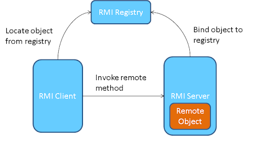

# turbo-giggle
JAVA RMI (MST - graph algorithm)

## How to run
```
javac *.java
java Server <server_port>
java Client <server_ip> <server_port>
```
client needs to know the **server_ip** and the **server_port** on which the rmi registry is
created. In case Server and Client are on the same machine than **server_ip**
will be localhost(127.0.0.1)

## Architecture
Java RMI application uses a single server multiple clients architecture. In this
specific application multiple clients can create graphs(weighted and undirected), 
add edges to the graph and query for the weight of minimum spanning tree.

Java RMI is an RPC(Remote Procedure Call) library.
The client uses a stub object which is a reference to a remote object defined
by the server. Using this it can call various methods defined for that object.
This object is an **interface** in java. A class **implements** this interface
on the server side. The choice of just exposing the **interface** is very
important as the client only needs to know the method signature and not the
hidden implementation for it.

Java RMI internally handles the marshalling of 'arguments to the method' and
transporting it on a network to the server. The arguments are un-marshalled on
the server side. The server needs to bind the object to registry which is
running on a specified port (port number can be given by user). Using the IP
address and port number of registry on server, client can access the remote
object and perform the **RPC**. RMI is thread safe which means that multiple
clients can simultaneously call remote methods on stub and RMI guarantees mutual
exclusion.


## Algorithm
1. MST class maintains a HashMap<String, Graph> .
2. Each Graph stores a list of Edges and number of vertices.
3. Edge consist of **u**, **v**, **w**.
4. Graph class provides a method which returns the sum of edges of Minimum
   spanning tree. It uses Disjoint set union (DSU) algorithm.
5. Each time the edge with the minimal weight is picked and it is added in the
   MST if both the end points are not in the same set.
6. This is repeated till we get **n-1** edges in our MST.
7. In case MST does not exists it returns -1.
```
Time complexity -> O(Elog(E) + N-1) where E = Edges and N = vertices
```

